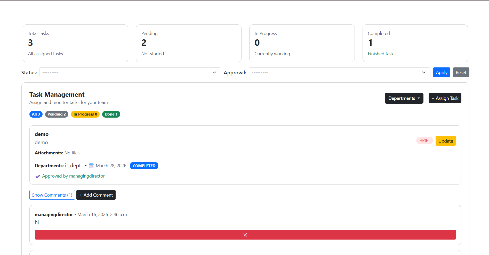

# 🚀 Employee Task Management Dashboard

A role-based **Task Management System** built with Django to streamline task assignment, approval workflows, and departmental execution.

---

## 📌 Overview

This system enables structured task delegation across an organization with strict **role-based access control** and approval mechanisms. It ensures that tasks are properly reviewed before reaching departments, improving accountability and workflow efficiency.

---

## ✨ Features

### 🔐 Role-Based Access Control

* **Super Admin**

  * Full system control
  * Approves tasks before execution
  * Can assign tasks and add comments

* **Admin**

  * Can assign tasks to departments
  * Can add comments on tasks

* **Department Users**

  * View assigned tasks only after approval
  * Access task details, deadlines, attachments, and comments
  * Cannot modify or comment (read-only access)

---

### 📝 Task Management

* Assign tasks to departments with deadlines
* Attach files to tasks
* Tasks require **Super Admin approval** before visibility
* Structured workflow ensuring controlled execution

---

### 💬 Comment System

* Super Admin and Admin can add comments on tasks
* Departments can view comments but cannot respond
* Enables top-down communication and clarity

---

### 📊 Dashboards

* Main Dashboard overview
* Super Admin Dashboard
* Admin Dashboard
* Department Dashboard

Each dashboard provides role-specific views and controls.

---

## 📸 Screenshots

### 🏠 Main Dashboard

<p align="center">
  
</p>

### 🛡️ Super Admin Dashboard

<p align="center">
  
</p>

### ⚙️ Admin Dashboard

<p align="center">
  
</p>

### 🏢 Department Dashboard

<p align="center">
  
</p>

---

## 🛠️ Tech Stack

**Frontend:**

* HTML
* CSS
* Bootstrap

**Backend:**

* Django

**Database:**

* PostgreSQL

**Deployment:**

* Render

---

## ⚙️ Setup Instructions

```bash
git clone https://github.com/your-username/your-repo.git
cd your-repo

python -m venv env
env\Scripts\activate

pip install -r requirements.txt

python manage.py migrate
python manage.py runserver
```

---

## 🔒 Environment Variables

Create a `.env` file in the root directory:

```
SECRET_KEY=your-secret-key
DEBUG=True
ALLOWED_HOSTS=127.0.0.1,localhost
DATABASE_URL=your-postgresql-url
```

---

## 📈 Key Highlights

* Implemented **multi-level role-based access control (RBAC)**
* Designed an **approval-based workflow system**
* Built scalable architecture with PostgreSQL
* Deployed full-stack application on Render

---

## 📬 Contact

For queries or collaboration, feel free to reach out.

---

⭐ If you like this project, consider giving it a star!
