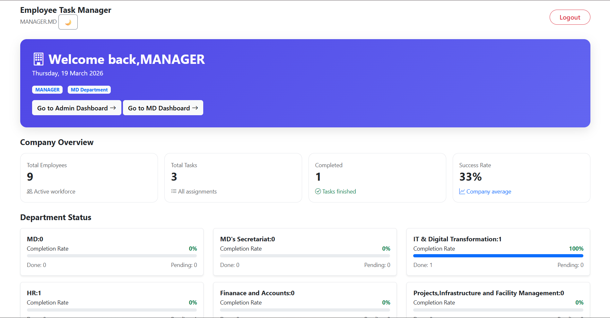
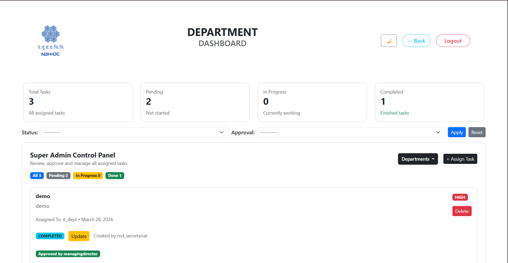
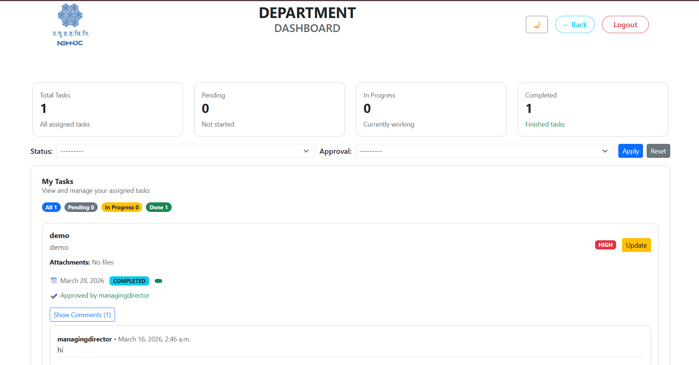

# 🧑‍💼 Employee Task Management Dashboard

A role-based task management system built using Django that streamlines task assignment, approval, and tracking across organizational departments.

---

## 🚀 Features

### 🔐 Role-Based Access Control
- **Super Admin**
  - Full system control
  - Assign tasks
  - Approve or reject tasks
  - Add comments on tasks  

- **Admin**
  - Assign tasks to departments
  - Add comments on tasks  

- **Department Users**
  - View assigned tasks (only after approval)
  - Access deadlines and attachments
  - View comments (read-only)

---

## 📌 Task Workflow

1. Tasks are created by **Super Admin** or **Admin**
2. Tasks are assigned to specific **Departments**
3. Each task includes:
   - Title and description  
   - Deadline  
   - File attachments  
4. Tasks must be **approved by Super Admin**
5. Only approved tasks appear in the **Department Dashboard**

---

## 💬 Comment System

- Super Admin and Admin can add comments on tasks  
- Departments can:
  - View all comments  
  - Cannot add or edit comments (read-only access)

---

## 📊 Dashboards

- Main Dashboard  
- Super Admin Dashboard  
- Admin Dashboard  
- Department Dashboard  

Each dashboard provides role-specific functionality and insights.

---

## 🛠️ Tech Stack

- **Frontend:** HTML, CSS, Bootstrap  
- **Backend:** Django  
- **Database:** PostgreSQL  
- **Deployment:** Render  

---

## 📷 Screenshots

> Add your screenshots below

```md





# Clone the repository
git clone https://github.com/your-username/employee-task-dashboard.git

# Navigate into the project directory
cd employee-task-dashboard

# Create a virtual environment
python -m venv env

# Activate the environment (Windows)
env\Scripts\activate

# Install dependencies
pip install -r requirements.txt

# Apply migrations
python manage.py migrate

# Create superuser
python manage.py createsuperuser

# Run the development server
python manage.py runserver

📈 Future Enhancements

Notification system (real-time + email)

Task status tracking (Pending / In Progress / Completed)

Analytics dashboard for performance monitoring

Role-based API integration

File preview support
